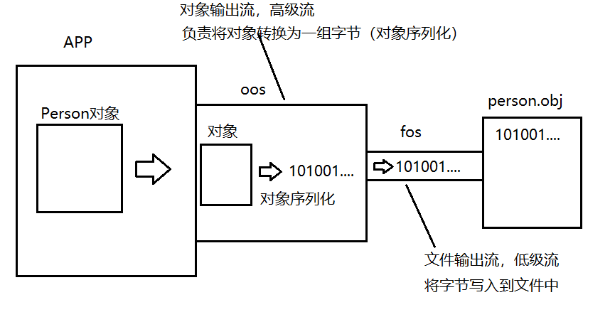
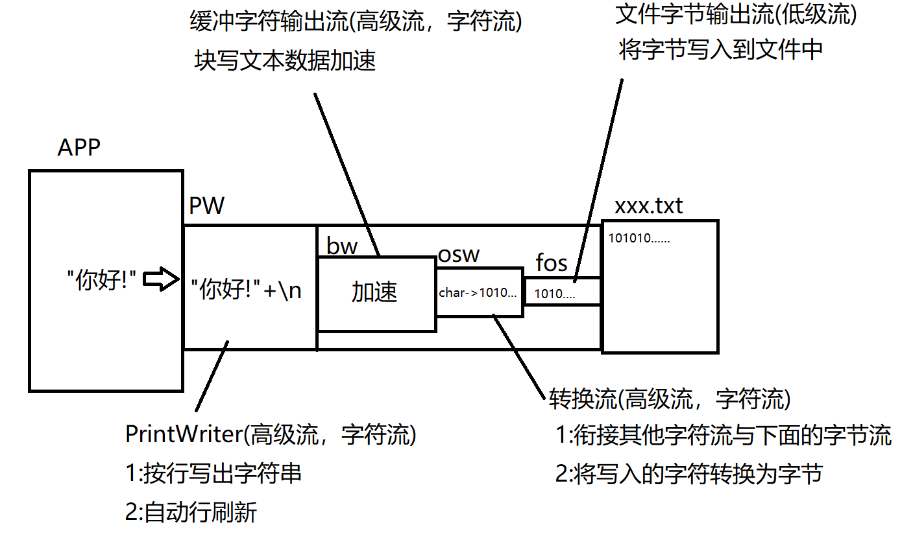

# day06

#### 对象流

java.io.ObjectOutputStream和ObjectInputSteam

对象流是一对高级流，在流连接中的作用是进行对象的序列化与反序列化。

对象序列化:将一个java对象按照其结构转换为一组字节的过程

对象反序列化:将一组字节还原为java对象(前提是这组字节是一个对象序列化得到的字节)


##### 对象序列化的流连接操作原理图:



```java
package io;

import java.io.FileNotFoundException;
import java.io.FileOutputStream;
import java.io.IOException;
import java.io.ObjectOutputStream;

/**
 * 对象流
 * java.io.ObjectOutputStream和ObjectInputSteam
 * 对象流是一对高级流，在流连接中的作用是进行对象的序列化与反序列化
 *
 * 对象序列化:将一个java对象按照其结构转换为一组字节的过程
 * 对象反序列化:将一组字节还原为java对象(前提是这组字节是一个对象序列化得到的字节)
 */
public class OOSDemo {
    public static void main(String[] args) throws IOException {
        //将一个Person对象写入文件person.obj
        String name = "苍#null";
        int age = 18;
        String gender = "女";
        String[] otherInfo = {"是一名台词不多的演员","来自岛国","爱好写大字","广大男性同胞的启蒙老师"};
        Person p = new Person(name,age,gender,otherInfo);
        System.out.println(p);

        FileOutputStream fos = new FileOutputStream("person.obj");
        ObjectOutputStream oos = new ObjectOutputStream(fos);

        oos.writeObject(p);
        System.out.println("写出完毕!");

        oos.close();

    }
}
```


##### 对象反序列化

```java
package io;

import java.io.FileInputStream;
import java.io.FileNotFoundException;
import java.io.IOException;
import java.io.ObjectInputStream;

/**
 * 使用对象输入流完成对象的反序列化
 */
public class OISDemo {
    public static void main(String[] args) throws IOException, ClassNotFoundException {
        //从person.obj文件中将对象反序列化回来
        FileInputStream fis = new FileInputStream("person.obj");
        ObjectInputStream ois = new ObjectInputStream(fis);
        /*
            Object readObject()
            该方法会进行对象的反序列化，如果对象流通过其连接的流读取的字节分析并非
            是一个java对象时，会抛出异常:ClassNotFoundException
         */
        Person p = (Person)ois.readObject();
        System.out.println(p);
    }
}
```


```java
package io;

import java.io.Serializable;
import java.util.Arrays;

/**
 * 使用当前类实例测试对象流的读写操作
 */
public class Person implements Serializable {
    private String name;//姓名
    private int age;//年龄
    private String gender;//性别
    private String[] otherInfo;//其他信息

    public Person(String name, int age, String gender, String[] otherInfo) {
        this.name = name;
        this.age = age;
        this.gender = gender;
        this.otherInfo = otherInfo;
    }

    public String getName() {
        return name;
    }

    public void setName(String name) {
        this.name = name;
    }

    public int getAge() {
        return age;
    }

    public void setAge(int age) {
        this.age = age;
    }

    public String getGender() {
        return gender;
    }

    public void setGender(String gender) {
        this.gender = gender;
    }

    public String[] getOtherInfo() {
        return otherInfo;
    }

    public void setOtherInfo(String[] otherInfo) {
        this.otherInfo = otherInfo;
    }

    @Override
    public String toString() {
        return "Person{" +
                "name='" + name + '\'' +
                ", age=" + age +
                ", gender='" + gender + '\'' +
                ", otherInfo=" + Arrays.toString(otherInfo) +
                '}';
    }
}
```


### 字符流

- java将流按照读写单位划分为字节流与字符流.
- java.io.InputStream和OutputStream是所有字节流的超类
- 而java.io.Reader和Writer则是所有字符流的超类,它们和字节流的超类是平级关系.
- Reader和Writer是两个抽象类,里面规定了所有字符流都必须具备的读写字符的相关方法.
- 字符流最小读写单位为字符(char),但是底层实际还是读写字节,只是字符与字节的转换工作由字符流完成.

#### 转换流

java.io.InputStreamReader和OutputStreamWriter

它们是字符流非常常用的一对实现类同时也是一对高级流,实际开发中我们不直接操作它们,但是它们在流连接中是非常重要的一环.


##### 使用转换输出流向文件中写入文本数据


```java
package io;

import java.io.FileNotFoundException;
import java.io.FileOutputStream;
import java.io.IOException;
import java.io.OutputStreamWriter;

/**
 * 字符流
 * java将流按照读写单位划分为字节流与字符流.
 * java.io.InputStream和OutputStream是所有字节流的超类
 * 而java.io.Reader和Writer则是所有字符流的超类,它们是平级关系.
 *
 * Reader和Writer是两个抽象类,里面规定了所有字符流都必须具备的读写字符的相关方法.
 * 字符流最小读写单位为字符(char),但是底层实际还是读写字节,只是字符与字节的转换工作由
 * 字符流完成.
 *
 * 转换流
 * java.io.InputStreamReader和OutputStreamWriter
 * 它们是字符流非常常用的一对实现类同时也是一对高级流,实际开发中我们不直接操作它们,但是
 * 它们在流连接中是非常重要的一环.
 */
public class OSWDemo {
    public static void main(String[] args) throws IOException {
        //向文件osw.txt中写入文字
        FileOutputStream fos = new FileOutputStream("osw.txt");
        OutputStreamWriter osw = new OutputStreamWriter(fos,"UTF-8");
        osw.write("我可以接受你的所有,所有小脾气.");
        osw.write("我可以带你去吃很多,很多好东西.");
        System.out.println("写出完毕!");
        osw.close();
    }
}
```

##### 使用转换输入流读取文本文件

```java
package io;

import java.io.*;

/**
 * 转换字符输入流
 * 可以将读取的字节按照指定的字符集转换为字符
 */
public class ISRDemo {
    public static void main(String[] args) throws IOException {
        //将osw.txt文件中的所有文字读取回来.
        FileInputStream fis = new FileInputStream("osw.txt");
        InputStreamReader isr = new InputStreamReader(fis,"UTF-8");
        /*
            字符流读一个字符的read方法定义:
            int read()
            读取一个字符,返回的int值实际上表示的是一个char(低16位有效).如果返回的
            int值表示的是-1则说明EOF
         */
        //测试读取文件中第一个字
//        int d = isr.read();
//        char c = (char)d;
//        System.out.println(c);

        //循环将文件所有字符读取回来
        int d;
        while((d = isr.read()) != -1){
            System.out.print((char)d);
        }


        isr.close();
    }
}
```

##### 转换流的意义:

实际开发中我们还有功能更好用的字符高级流.但是其他的字符高级流都有一个共通点:不能直接连接在字节流上.而实际操作设备的流都是低级流同时也都是字节流.因此不能直接在流连接中串联起来.转换流是一对可以连接在字节流上的字符流,其他的高级字符流可以连接在转换流上.在流连接中起到"转换器"的作用(负责字符与字节的实际转换)


#### 缓冲字符流

##### 缓冲字符输出流:java.io.PrintWriter

java.io.BufferedWriter和BufferedReader

缓冲字符流内部也有一个缓冲区,读写文本数据以块读写形式加快效率.并且缓冲流有一个特别的功能:可以按行读写文本数据.

java.io.PrintWriter具有自动行刷新的缓冲字符输出流,实际开发中更常用.它内部总是会自动连接BufferedWriter作为块写加速使用.



```java
package io;

import java.io.FileNotFoundException;
import java.io.PrintWriter;
import java.io.UnsupportedEncodingException;

/**
 * 缓冲字符流
 * 缓冲字符流是一对高级流,在流连接中的作用是提高读写文本数据的效率,并且
 * 可以安行读写字符串.
 * java.io.BufferedReader和BufferedWriter
 *
 * 实际开发中缓冲字符输出流我们更常用的是PrintWriter,具有自动行刷新功能
 * 的缓冲字符输出流,其内部总是连接BufferedWriter作为缓冲加速使用.
 */
public class PWDemo1 {
    public static void main(String[] args) throws FileNotFoundException, UnsupportedEncodingException {
        /*
            PrintWriter提供了对文件操作的构造方法:
            PrintWriter(String path)
            PrintWriter(File file)
         */
        //向文件中写入字符串
        PrintWriter pw = new PrintWriter("pw.txt","UTF-8");
        pw.println("我看过沙漠下暴雨");
        pw.println("看过大海亲吻鲨鱼");
        pw.println("看过黄昏追逐黎明");
        pw.println("没看过你");
        System.out.println("写出完毕!");
        pw.close();


    }
}

```

##### 在流链接中使用PW

```java
package io;

import java.io.*;
import java.nio.charset.StandardCharsets;
import java.util.Scanner;

/**
 * 在流连接中使用PW
 */
public class PWDemo2 {
    public static void main(String[] args) throws FileNotFoundException {
        //文件字节输出流(是一个低级流)，向文件中写入字节数据
        FileOutputStream fos = new FileOutputStream("pw2.txt",true);
        //转换输出流(是一个高级流，且是一个字符流)。1:衔接字符与字节流 2:将写出的字符转换为字节
        OutputStreamWriter osw = new OutputStreamWriter(fos, StandardCharsets.UTF_8);
        //缓冲输出流(是一个高级流，且是一个字符流)。块写文本数据加速
        BufferedWriter bw = new BufferedWriter(osw);
        //具有自动行刷新的缓冲字符输出流
        PrintWriter pw = new PrintWriter(bw);

        //完成简易记事本。控制台输入的每行字符串都按行写入文件。单独输入exit时退出。
        Scanner scanner = new Scanner(System.in);
        while(true){
            String line = scanner.nextLine();
            if("exit".equalsIgnoreCase(line)){
                break;
            }
            pw.println(line);
        }
        pw.close();
    }
}


```

##### PrintWriter的自动行刷新功能

如果实例化PW时第一个参数传入的是一个流，则此时可以再传入一个boolean型的参数，此值为true时就打开了自动行刷新功能。
即:
每当我们用PW的println方法写出一行字符串后会自动flush.

```java
package io;

import java.io.*;
import java.nio.charset.StandardCharsets;
import java.util.Scanner;

/**
 * 在流连接中使用PW
 */
public class PWDemo2 {
    public static void main(String[] args) throws FileNotFoundException {
        //文件字节输出流(是一个低级流)，向文件中写入字节数据
        FileOutputStream fos = new FileOutputStream("pw2.txt",true);
        //转换输出流(是一个高级流，且是一个字符流)。1:衔接字符与字节流 2:将写出的字符转换为字节
        OutputStreamWriter osw = new OutputStreamWriter(fos, StandardCharsets.UTF_8);
        //缓冲输出流(是一个高级流，且是一个字符流)。块写文本数据加速
        BufferedWriter bw = new BufferedWriter(osw);
        //具有自动行刷新的缓冲字符输出流
        /*
            PrintWriter提供的构造器中，当第一个参数为一个流时，就支持再传入一个boolean
            型的参数表示是否自动行刷新。当该值为true时则打开了自动行刷新功能。这意味着
            每当我们调用println方法后会自动flush一次。
         */
        PrintWriter pw = new PrintWriter(bw,true);

        //完成简易记事本。控制台输入的每行字符串都按行写入文件。单独输入exit时退出。
        Scanner scanner = new Scanner(System.in);
        while(true){
            String line = scanner.nextLine();
            if("exit".equalsIgnoreCase(line)){
                break;
            }
            pw.println(line);
        }
        pw.close();
    }
}


```

```java


```