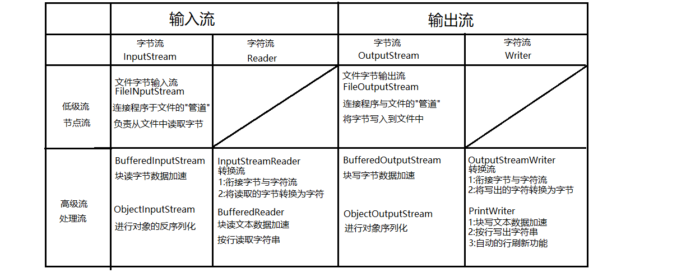

# day07

#### 缓冲字符流

##### 缓冲字符输入流:java.io.BufferedReader

是一个高级的字符流，特点是块读文本数据，并且可以按行读取字符串。

```java
package io;

import java.io.*;

/**
 * 使用java.io.BufferedReader按行读取文本数据
 */
public class BRDemo {
    public static void main(String[] args) throws IOException {
        //将当前源程序读取出来并输出到控制台上
        FileInputStream fis = new FileInputStream(
                "src/main/java/io/BRDemo.java");
        InputStreamReader isr = new InputStreamReader(fis);
        BufferedReader br = new BufferedReader(isr);

        String line;
        /*
            BufferedReader提供了一个读取一行字符串的方法:
            String readLine()
            该方法会返回一行字符串，返回的字符串不含有最后的换行符。
            当某一行是空行时(该行内容只有一个换行符)则返回值为空字符串。
            如果流读取到了末尾，则返回值为null。
         */
        while((line = br.readLine()) != null) {
            System.out.println(line);
        }
        br.close();
    }
}
```

##### IO总结




### 异常处理

#### java异常处理机制

- java中所有错误的超类为:Throwable。其下有两个子类:Error和Exception
- Error的子类描述的都是系统错误，比如虚拟机内存溢出等。
- Exception的子类描述的都是程序错误，比如空指针，下表越界等。
- 通常我们程序中处理的异常都是Exception。

#### 异常处理机制中的try-catch

```java
package exception;

/**
 * 异常处理机制中的try-catch
 * 语法:
 * try{
 *     可能出现异常的代码片段
 * }catch(XXXException e){
 *     try中出现XXXException后的处理代码
 * }
 *
 * try语句块不能独立存在，后面必须跟catch语句块或finally语句块
 */
public class TryCatchDemo {
    public static void main(String[] args) {
        System.out.println("程序开始了");
        try {
//            String line = null;
//            String line = "";
            String line = "abc";
            //当JVM执行程序出现了某个异常时就会实例化这个异常并将其抛出
            //如果该异常没有被异常处理机制控制，则JVM会将异常隐式抛出当方法外(这里是main方法外)
            System.out.println(line.length());
            System.out.println(line.charAt(0));
            System.out.println(Integer.parseInt(line));
            //若try语句块中某句话出错了，则剩下的代码都不会执行!
            System.out.println("!!!!!!!!!!!!!!!!");


//        }catch(NullPointerException e){
//            System.out.println("出现了空指针!");
//        //catch可以定义多个，当try中不同的异常有不同处理办法时可分开捕获并处理
//        }catch(StringIndexOutOfBoundsException e){
//            System.out.println("出现了下标越界!");
        //若某些异常的处理方式相同时，可以合并在一个catch来处理
        }catch(NullPointerException|StringIndexOutOfBoundsException e){
            System.out.println("出现了空指针或下标越界并处理了!");
        //可以在下面catch超类异常来捕获并处理这一类异常。
        }catch(Exception e){
            System.out.println("反正就是出了个错");
        }

        System.out.println("程序结束了");

    }
}

```

# day06

#### 异常处理机制中的finally

- finally块定义在异常处理机制中的最后一块。它可以直接跟在try之后，或者最后一个catch之后。
  
- finally可以保证只要程序执行到了try语句块中，无论try语句块中的代码是否出现异常，最终finally都必定执行。
- finally通常用来做释放资源这类操作。

```java
package exception;

/**
 * 异常处理机制中的finally块
 * finally块定义在异常处理机制中的最后一块。它可以直接跟在try之后，或者最后一个catch之后。
 *
 * finally可以保证只要程序执行到了try语句块中，无论try语句块中的代码是否出现异常，最终
 *  finally都必定执行。
 *
 * finally通常用来做释放资源这类操作。
 */
public class FinallyDemo {
    public static void main(String[] args) {
        System.out.println("程序开始了...");
        try{
            String line = "abc";
//            String line = null;
            System.out.println(line.length());
            return;
        }catch(Exception e){
            System.out.println("出错了!");
        }finally{
            System.out.println("finally中的代码执行了!");
        }
        System.out.println("程序结束了!");
    }
}
```

#### IO操作时的异常处理机制应用

```java
package exception;

import java.io.FileOutputStream;
import java.io.IOException;

/**
 * IO操作时的异常处理机制应用
 */
public class FinallyDemo2 {
    public static void main(String[] args) {
        FileOutputStream fos = null;
        try {
            fos = new FileOutputStream("fos.dat");
            fos.write(1);
        } catch (IOException e) {
            e.printStackTrace();//向控制台输出当前异常的错误信息
        } finally {
            try {
                if (fos!=null) {
                    fos.close();
                }
            } catch (IOException e) {
                e.printStackTrace();
            }
        }
    }
}
```

#### 自动关闭特性

JDK7之后，java提供了一个新的特性:自动关闭。旨在IO操作中可以更简洁的使用异常处理机制完成最后的close操作。

```java
语法:
try(
   	定义需要在finally中调用close()方法关闭的对象.
){
    IO操作
}catch(XXXException e){
    ...
}
```

上述语法中可在try的"()"中定义的并初始化的对象必须实现了java.io.AutoCloseable接口,否则编译不通过.

```
public class AutocloseableDemo {
    public static void main(String[] args) {
        try(
                FileOutputStream fos = new FileOutputStream("fos.dat");
        ){
            fos.write(1);
        } catch (IOException e) {
            e.printStackTrace();//向控制台输出当前异常的错误信息
        }
    }
}
```

上述代码是编译器认可的，而不是虚拟机。编译器在编译上述代码后会在编译后的class文件中改回成FinallyDemo2案例的代码样子(上次课最后的案例)。

#### throw关键字

throw用来对外主动抛出一个异常，通常下面两种情况我们主动对外抛出异常:

- 1:当程序遇到一个满足语法，但是不满足业务要求时，可以抛出一个异常告知调用者。
- 2:程序执行遇到一个异常，但是该异常不应当在当前代码片段被解决时可以抛出给调用者。

```java
package exception;

/**
 * 测试异常的抛出
 */
public class Person {
    private int age;

    public int getAge() {
        return age;
    }

    public void setAge(int age) throws Exception {
        if(age<0||age>100){
            //使用throw对外抛出一个异常
            throw new RuntimeException("年龄不合法!");
        }
        this.age = age;
    }
}
```

```java
package exception;

/**
 * throw关键字，用来对外主动抛出一个异常。
 * 通常下面两种情况我们主动对外抛出异常:
 * 1:当程序遇到一个满足语法，但是不满足业务要求时，可以抛出一个异常告知调用者。
 * 2:程序执行遇到一个异常，但是该异常不应当在当前代码片段被解决时可以抛出给调用者。
 */
public class ThrowDemo {
    public static void main(String[] args) {
        Person p = new Person();
        p.setAge(10000);//符合语法，但是不符合业务逻辑要求。
        System.out.println("此人年龄:"+p.getAge());
    }
}
```


#### throws关键字

当一个方法中使用throw抛出一个非RuntimeException的异常时，就要在该方法上使用throws声明这个异常的抛出。此时调用该方法的代码就必须处理这个异常，否则编译不通过。

```java
package exception;

/**
 * 测试异常的抛出
 */
public class Person {
    private int age;

    public int getAge() {
        return age;
    }

    /**
     * 当一个方法使用throws声明异常抛出时,调用此方法的代码片段就必须处理这个异常
     */
    public void setAge(int age) throws Exception {
        if(age<0||age>100){
            //使用throw对外抛出一个异常
//            throw new RuntimeException("年龄不合法!");
            //除了RuntimeException之外,抛出什么异常就要在方法上声明throws什么异常
            throw new Exception("年龄不合法!");
        }
        this.age = age;
    }
}
```

当我们调用一个含有throws声明异常抛出的方法时，编译器要求我们必须处理这个异常，否则编译不通过。 处理手段有两种:

- 使用try-catch捕获并处理这个异常
- 在当前方法(本案例就是main方法)上继续使用throws声明该异常的抛出给调用者解决。 具体选取那种取决于异常处理的责任问题。

```java
package exception;

/**
 * throw关键字，用于主动对外抛出一个异常
 */
public class ThrowDemo {
    public static void main(String[] args){
        System.out.println("程序开始了...");
        try {
            Person p = new Person();
            /*
                当我们调用一个含有throws声明异常抛出的方法时,编译器要求
                我们必须添加处理异常的手段,否则编译不通过.而处理手段有两种
                1:使用try-catch捕获并处理异常
                2:在当前方法上继续使用throws声明该异常的抛出
                具体用哪种取决于异常处理的责任问题
             */
            p.setAge(100000);//典型的符合语法，但是不符合业务逻辑要求
            System.out.println("此人年龄:"+p.getAge()+"岁");
        } catch (Exception e) {
            e.printStackTrace();
        }

        System.out.println("程序结束了...");
    }
}
```

####  注意，永远不应当在main方法上使用throws!!


#### 含有throws的方法被子类重写时的规则

```java
package exception;

import java.awt.*;
import java.io.FileNotFoundException;
import java.io.IOException;
import java.sql.SQLException;

/**
 * 子类重写超类含有throws声明异常抛出的方法时对throws的几种特殊的重写规则
 */
public class ThrowsDemo {
    public void dosome()throws IOException, AWTException {}
}
class SubClass extends ThrowsDemo{
//    public void dosome()throws IOException, AWTException {}

    //可以不再抛出任何异常
//    public void dosome(){}

    //可以仅抛出部分异常
//    public void dosome()throws IOException {}

    //可以抛出超类方法抛出异常的子类型异常
//    public void dosome()throws FileNotFoundException {}

    //不允许抛出额外异常(超类方法中没有的,并且没有继承关系的异常)
//    public void dosome()throws SQLException {}

    //不可以抛出超类方法抛出异常的超类型异常
//    public void dosome()throws Exception {}
}
```


#### Java异常可以分为可检测异常，非检测异常：

- 可检测异常：可检测异常经编译器验证，对于声明抛出异常的任何方法，编译器将强制执行处理或声明规则，不捕捉这个异常，编译器就通不过，不允许编译
- 非检测异常：非检测异常不遵循处理或者声明规则。在产生此类异常时，不一定非要采取任何适当操作，编译器不会检查是否已经解决了这样一个异常
- RuntimeException 类属于非检测异常，因为普通JVM操作引起的运行时异常随时可能发生，此类异常一般是由特定操作引发。但这些操作在java应用程序中会频繁出现。因此它们不受编译器检查与处理或声明规则的限制。


#### 常见的RuntimeException子类

- IllegalArgumentException：抛出的异常表明向方法传递了一个不合法或不正确的参数
- NullPointerException：当应用程序试图在需要对象的地方使用 null 时，抛出该异常
- ArrayIndexOutOfBoundsException：当使用的数组下标超出数组允许范围时，抛出该异常
- ClassCastException：当试图将对象强制转换为不是实例的子类时，抛出该异常
- NumberFormatException：当应用程序试图将字符串转换成一种数值类型，但该字符串不能转换为适当格式时，抛出该异常。

####  

```java

```

```java

```

```java

```
