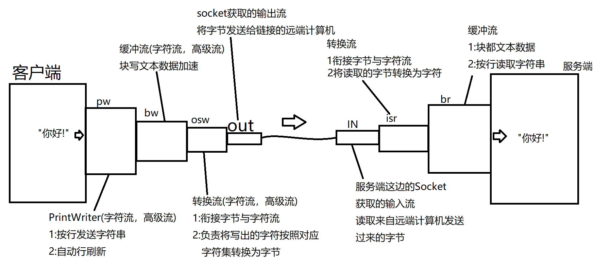

# day08

#### Java异常可以分为可检测异常，非检测异常：

- 可检测异常：可检测异常经编译器验证，对于声明抛出异常的任何方法，编译器将强制执行处理或声明规则，不捕捉这个异常，编译器就通不过，不允许编译
- 非检测异常：非检测异常不遵循处理或者声明规则。在产生此类异常时，不一定非要采取任何适当操作，编译器不会检查是否已经解决了这样一个异常
- RuntimeException 类属于非检测异常，因为普通JVM操作引起的运行时异常随时可能发生，此类异常一般是由特定操作引发。但这些操作在java应用程序中会频繁出现。因此它们不受编译器检查与处理或声明规则的限制。


#### 常见的RuntimeException子类

- IllegalArgumentException：抛出的异常表明向方法传递了一个不合法或不正确的参数
- NullPointerException：当应用程序试图在需要对象的地方使用 null 时，抛出该异常
- ArrayIndexOutOfBoundsException：当使用的数组下标超出数组允许范围时，抛出该异常
- ClassCastException：当试图将对象强制转换为不是实例的子类时，抛出该异常
- NumberFormatException：当应用程序试图将字符串转换成一种数值类型，但该字符串不能转换为适当格式时，抛出该异常。

####  

#### 异常中常用的方法

```java
package exception;

/**
 * 异常常见的方法
 */
public class ExceptionApiDemo {
    public static void main(String[] args) {
        System.out.println("程序开始了");

        try {
            String str = "abc";
            System.out.println(Integer.parseInt(str));
        } catch (NumberFormatException e) {
            //异常最常用的方法,用于将当前错误信息输出到控制台
            e.printStackTrace();

            //获取错误消息.记录日志的时候或提示给用户可以使用它
            String message = e.getMessage();
            System.out.println(message);

        }

        System.out.println("程序结束了");
    }
}
```


#### 自定义异常

自定义异常通常用来定义那些业务上的异常问题。

定义自定义异常需要注意以下问题:

- 异常的类名要做到见名知义
- 需要是Exception的子类
- 提供超类异常提供的所有种类构造器

```java
package exception;

/**
 * 非法的年龄异常
 *
 * 自定义异常通常用来说明业务上的错误.
 * 自定义异常要注意以下问题:
 * 1:定义的类名要做到见名知义
 * 2:必须是Exception的子类
 * 3:提供Exception所定义的所有构造方法
 */
public class IllegalAgeException extends Exception{
    public IllegalAgeException() {
    }

    public IllegalAgeException(String message) {
        super(message);
    }

    public IllegalAgeException(String message, Throwable cause) {
        super(message, cause);
    }

    public IllegalAgeException(Throwable cause) {
        super(cause);
    }

    public IllegalAgeException(String message, Throwable cause, boolean enableSuppression, boolean writableStackTrace) {
        super(message, cause, enableSuppression, writableStackTrace);
    }
}
```

```java
package exception;

/**
 * 测试异常的抛出
 */
public class Person {
    private int age;

    public int getAge() {
        return age;
    }

    /**
     * 当一个方法使用throws声明异常抛出时,调用此方法的代码片段就必须处理这个异常
     */
    public void setAge(int age) throws IllegalAgeException {
        if(age<0||age>100){
            //使用throw对外抛出一个异常
//            throw new RuntimeException("年龄不合法!");
            //除了RuntimeException之外,抛出什么异常就要在方法上声明throws什么异常
//            throw new Exception("年龄不合法!");

            //抛出自定义异常
            throw new IllegalAgeException("年龄超范围:"+age);

        }
        this.age = age;
    }
}
```

```JAVA
package exception;

/**
 * throw关键字，用于主动对外抛出一个异常
 */
public class ThrowDemo {
    public static void main(String[] args){
        System.out.println("程序开始了...");
        try {
            Person p = new Person();
            /*
                当我们调用一个含有throws声明异常抛出的方法时,编译器要求
                我们必须添加处理异常的手段,否则编译不通过.而处理手段有两种
                1:使用try-catch捕获并处理异常
                2:在当前方法上继续使用throws声明该异常的抛出
                具体用哪种取决于异常处理的责任问题
             */
            p.setAge(100000);//典型的符合语法，但是不符合业务逻辑要求
            System.out.println("此人年龄:"+p.getAge()+"岁");
        } catch (IllegalAgeException e) {
            e.printStackTrace();
        }

        System.out.println("程序结束了...");
    }
}
```


#### 总结:

异常处理机制是用来处理那些可能存在的异常，但是无法通过修改逻辑完全规避的场景。

而如果通过修改逻辑可以规避的异常是bug，不应当用异常处理机制在运行期间解决！应当在编码时及时修正


### java网络编程

#### java.net.Socket

Socket(套接字)封装了TCP协议的通讯细节，是的我们使用它可以与服务端建立网络链接，并通过 它获取两个流(一个输入一个输出)，然后使用这两个流的读写操作完成与服务端的数据交互

#### java.net.ServerSocket

ServerSocket运行在服务端，作用有两个:

1:向系统申请服务端口，客户端的Socket就是通过这个端口与服务端建立连接的。

2:监听服务端口，一旦一个客户端通过该端口建立连接则会自动创建一个Socket，并通过该Socket与客户端进行数据交互。

##### 如果我们把Socket比喻为电话，那么ServerSocket相当于是某客服中心的总机。

##### 与服务端建立连接案例:

```java
package socket;

import java.io.IOException;
import java.net.Socket;

/**
 * 聊天室客户端
 */
public class Client {
    /*
        java.net.Socket 套接字
        Socket封装了TCP协议的通讯细节，我们通过它可以与远端计算机建立链接，
        并通过它获取两个流(一个输入，一个输出)，然后对两个流的数据读写完成
        与远端计算机的数据交互工作。
        我们可以把Socket想象成是一个电话，电话有一个听筒(输入流)，一个麦克
        风(输出流)，通过它们就可以与对方交流了。
     */
    private Socket socket;

    /**
     * 构造方法，用来初始化客户端
     */
    public Client(){
        try {
            System.out.println("正在链接服务端...");
            /*
                实例化Socket时要传入两个参数
                参数1:服务端的地址信息
                     可以是IP地址，如果链接本机可以写"localhost"
                参数2:服务端开启的服务端口
                我们通过IP找到网络上的服务端计算机，通过端口链接运行在该机器上
                的服务端应用程序。
                实例化的过程就是链接的过程，如果链接失败会抛出异常:
                java.net.ConnectException: Connection refused: connect
             */
            socket = new Socket("localhost",8088);
            System.out.println("与服务端建立链接!");
        } catch (IOException e) {
            e.printStackTrace();
        }
    }

    /**
     * 客户端开始工作的方法
     */
    public void start(){

    }

    public static void main(String[] args) {
        Client client = new Client();
        client.start();
    }
}
```

```java
package socket;

import java.io.IOException;
import java.net.ServerSocket;
import java.net.Socket;

/**
 * 聊天室服务端
 */
public class Server {
    /**
     * 运行在服务端的ServerSocket主要完成两个工作:
     * 1:向服务端操作系统申请服务端口，客户端就是通过这个端口与ServerSocket建立链接
     * 2:监听端口，一旦一个客户端建立链接，会立即返回一个Socket。通过这个Socket
     *   就可以和该客户端交互了
     *
     * 我们可以把ServerSocket想象成某客服的"总机"。用户打电话到总机，总机分配一个
     * 电话使得服务端与你沟通。
     */
    private ServerSocket serverSocket;

    /**
     * 服务端构造方法，用来初始化
     */
    public Server(){
        try {
            System.out.println("正在启动服务端...");
            /*
                实例化ServerSocket时要指定服务端口，该端口不能与操作系统其他
                应用程序占用的端口相同，否则会抛出异常:
                java.net.BindException:address already in use

                端口是一个数字，取值范围:0-65535之间。
                6000之前的的端口不要使用，密集绑定系统应用和流行应用程序。
             */
            serverSocket = new ServerSocket(8088);
            System.out.println("服务端启动完毕!");
        } catch (IOException e) {
            e.printStackTrace();
        }
    }

    /**
     * 服务端开始工作的方法
     */
    public void start(){
        try {
            System.out.println("等待客户端链接...");
            /*
                ServerSocket提供了接受客户端链接的方法:
                Socket accept()
                这个方法是一个阻塞方法，调用后方法"卡住"，此时开始等待客户端
                的链接，直到一个客户端链接，此时该方法会立即返回一个Socket实例
                通过这个Socket就可以与客户端进行交互了。
                
                可以理解为此操作是接电话，电话没响时就一直等。
             */
            Socket socket = serverSocket.accept();
            System.out.println("一个客户端链接了！");
        } catch (IOException e) {
            e.printStackTrace();
        }
    }

    public static void main(String[] args) {
        Server server = new Server();
        server.start();
    }
}
```


#### 客户端与服务端完成第一次通讯(发送一行字符串)

##### Socket提供了两个重要的方法:

OutputStream getOutputStream()

该方法会获取一个字节输出流，通过这个输出流写出的字节数据会通过网络发送给对方。

InputStream getInputStream()

通过该方法获取的字节输入流读取的是远端计算机发送过来的数据。




客户端代码：

```java
package socket;

import java.io.*;
import java.net.Socket;

/**
 * 聊天室客户端
 */
public class Client {
    /*
        java.net.Socket 套接字
        Socket封装了TCP协议的通讯细节，我们通过它可以与远端计算机建立链接，
        并通过它获取两个流(一个输入，一个输出)，然后对两个流的数据读写完成
        与远端计算机的数据交互工作。
        我们可以把Socket想象成是一个电话，电话有一个听筒(输入流)，一个麦克
        风(输出流)，通过它们就可以与对方交流了。
     */
    private Socket socket;

    /**
     * 构造方法，用来初始化客户端
     */
    public Client(){
        try {
            System.out.println("正在链接服务端...");
            /*
                实例化Socket时要传入两个参数
                参数1:服务端的地址信息
                     可以是IP地址，如果链接本机可以写"localhost"
                参数2:服务端开启的服务端口
                我们通过IP找到网络上的服务端计算机，通过端口链接运行在该机器上
                的服务端应用程序。
                实例化的过程就是链接的过程，如果链接失败会抛出异常:
                java.net.ConnectException: Connection refused: connect
             */
            socket = new Socket("localhost",8088);
            System.out.println("与服务端建立链接!");
        } catch (IOException e) {
            e.printStackTrace();
        }
    }

    /**
     * 客户端开始工作的方法
     */
    public void start(){
        try {
            /*
                Socket提供了一个方法:
                OutputStream getOutputStream()
                该方法获取的字节输出流写出的字节会通过网络发送给对方计算机。
             */
            //低级流，将字节通过网络发送给对方
            OutputStream out = socket.getOutputStream();
            //高级流，负责衔接字节流与字符流，并将写出的字符按指定字符集转字节
            OutputStreamWriter osw = new OutputStreamWriter(out,"UTF-8");
            //高级流，负责块写文本数据加速
            BufferedWriter bw = new BufferedWriter(osw);
            //高级流，负责按行写出字符串，自动行刷新
            PrintWriter pw = new PrintWriter(bw,true);

            pw.println("你好服务端!");

        } catch (IOException e) {
            e.printStackTrace();
        }
    }

    public static void main(String[] args) {
        Client client = new Client();
        client.start();
    }
}
```

服务端代码:

```java
package socket;

import java.io.BufferedReader;
import java.io.IOException;
import java.io.InputStream;
import java.io.InputStreamReader;
import java.net.ServerSocket;
import java.net.Socket;

/**
 * 聊天室服务端
 */
public class Server {
    /**
     * 运行在服务端的ServerSocket主要完成两个工作:
     * 1:向服务端操作系统申请服务端口，客户端就是通过这个端口与ServerSocket建立链接
     * 2:监听端口，一旦一个客户端建立链接，会立即返回一个Socket。通过这个Socket
     *   就可以和该客户端交互了
     *
     * 我们可以把ServerSocket想象成某客服的"总机"。用户打电话到总机，总机分配一个
     * 电话使得服务端与你沟通。
     */
    private ServerSocket serverSocket;

    /**
     * 服务端构造方法，用来初始化
     */
    public Server(){
        try {
            System.out.println("正在启动服务端...");
            /*
                实例化ServerSocket时要指定服务端口，该端口不能与操作系统其他
                应用程序占用的端口相同，否则会抛出异常:
                java.net.BindException:address already in use

                端口是一个数字，取值范围:0-65535之间。
                6000之前的的端口不要使用，密集绑定系统应用和流行应用程序。
             */
            serverSocket = new ServerSocket(8088);
            System.out.println("服务端启动完毕!");
        } catch (IOException e) {
            e.printStackTrace();
        }
    }

    /**
     * 服务端开始工作的方法
     */
    public void start(){
        try {
            System.out.println("等待客户端链接...");
            /*
                ServerSocket提供了接受客户端链接的方法:
                Socket accept()
                这个方法是一个阻塞方法，调用后方法"卡住"，此时开始等待客户端
                的链接，直到一个客户端链接，此时该方法会立即返回一个Socket实例
                通过这个Socket就可以与客户端进行交互了。

                可以理解为此操作是接电话，电话没响时就一直等。
             */
            Socket socket = serverSocket.accept();
            System.out.println("一个客户端链接了！");

            /*
                Socket提供的方法:
                InputStream getInputStream()
                获取的字节输入流读取的是对方计算机发送过来的字节
             */
            InputStream in = socket.getInputStream();
            InputStreamReader isr = new InputStreamReader(in,"UTF-8");
            BufferedReader br = new BufferedReader(isr);

            String message = br.readLine();
            System.out.println("客户端说:"+message);

        } catch (IOException e) {
            e.printStackTrace();
        }
    }

    public static void main(String[] args) {
        Server server = new Server();
        server.start();
    }
}
```